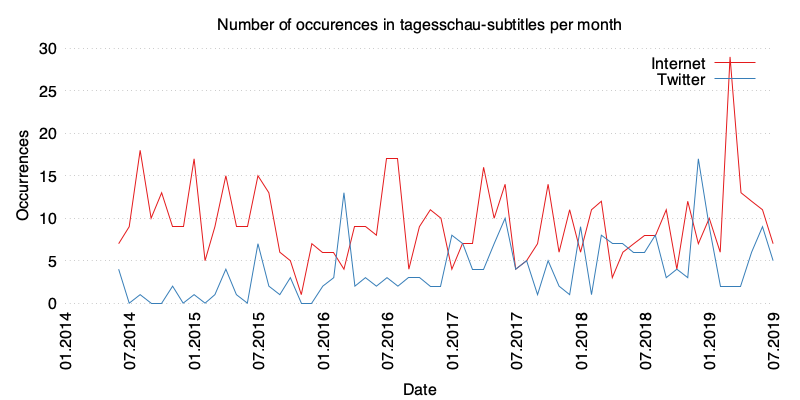

# tagesschau subtitles

Hacky scripts to download subtitles from tagesschau.de and plot the number of
occurences of specific words per month using Gnuplot.



## Usage

```bash
$ ./subtitles.sh
$ ./plot.sh twitter
$ ./plot.sh internet
$ gnuplot plot.gnu
$
```
